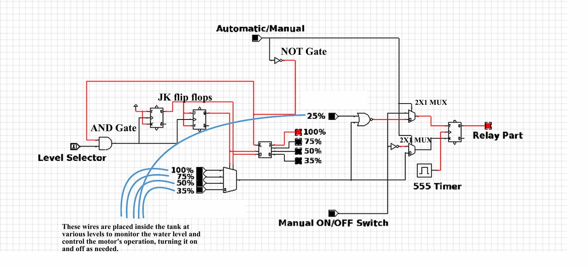

# 💧 Water Level Control System — Automatic & Manual  
### *Digital Logic Design using JK Flip-Flops, 555 Timer, MUX & Relay Control*

<p align="center">
  
</p>

---

## 📘 Project Overview  
This project demonstrates an **Automatic & Manual Water Level Controller** designed using **digital logic circuits** — without any microcontroller.  
It uses **JK Flip-Flops**, **555 Timer**, **MUX**, **Decoder**, and **Relay Driver** to control a water pump based on the **tank water level**.  

The controller automatically **starts the motor when water falls below 25%**, and **stops it at a user-selected upper threshold** (35%, 50%, 75%, or 100%).  
A manual override mode allows the user to directly operate the pump using a switch.

> 🏫 Developed as part of *19ECE384 – Open Lab Project (Team A6)*  
> **Amrita Vishwa Vidyapeetham, Coimbatore**

---

## 🎯 Objectives  
- Maintain optimal water level between pre-set limits.  
- Enable **automatic** pump operation using logic circuits.  
- Provide a **manual override** mode for user control.  
- Prevent **tank overflow and pump dry run**.  
- Design a **low-cost automation circuit** using only fundamental ICs.

---

## ⚙️ Components Used  

| Component | Specification | Function |
|------------|----------------|-----------|
| JK Flip-Flop | IC 74112 | Stores ON/OFF state |
| 555 Timer | Astable mode | Generates clock pulse |
| 4×1 MUX | IC 74153 | Selects level input |
| 3×8 Decoder | IC 74138 | Displays level indication |
| AND, NOR, NOT Gates | IC 7408, 7402, 7404 | Logical decisions |
| Relay | 5V DC | Motor control output |
| BC547 Transistors | 7 | Relay driver |
| Float Switches | 5 levels | Water level sensing |
| LEDs | 11 | Indication |
| Breadboard + Wires | - | Assembly |
| DC Motor | 1 | Water pump simulation |

---

## 🧩 System Design

### 🧱 Block Diagram
<p align="center">
  
</p>

> The block diagram illustrates the core flow between **sensors, logic gates, JK Flip-Flops, timer, and relay control**.  
> The logic section determines when to turn the motor ON or OFF based on water level inputs.

---

### 🔌 Circuit Diagram
<p align="center">
  
</p>

> The full hardware logic includes **555 timer**, **JK flip-flops**, **MUX**, **decoders**, and a **relay driver**.  
> LEDs represent the water level at each float sensor input.  

---

## 💡 Logic Explanation  

| Mode | Condition | Action |
|------|------------|--------|
| **Auto** | Level < 25% | Motor ON |
| **Auto** | Level ≥ selected threshold | Motor OFF |
| **Manual** | User Switch ON | Motor ON |
| **Manual** | User Switch OFF | Motor OFF |

- **555 Timer** provides a continuous clock (81.6 Hz).  
- **JK Flip-Flop** acts as a bistable state machine for motor control.  
- **MUX** selects user-defined water level threshold.  
- **Decoder** activates corresponding LED indicators.  
- **Relay** switches the motor ON/OFF accordingly.

---

## 🧮 Timing & Frequency Calculation  

**Formula:**  
```

T = 0.7 × (R1 + 2R2) × C

```

**For:**  
R1 = 1kΩ, R2 = 10kΩ, C = 1µF  
```

T ≈ 0.01225 s
f ≈ 81.63 Hz

```
✅ Generates stable clock signal for flip-flop toggling.

---

## 🧠 Truth Table

| Water Level | J | K | Q (Output) | Mode | Action |
|--------------|---|---|-------------|------|---------|
| <25% | 1 | 0 | 1 | Auto | Motor ON |
| 35–50% | 0 | 1 | 0 | Auto | Motor OFF |
| 75–100% | 0 | 1 | 0 | Auto | Motor OFF |
| X | X | X | User | Manual | User Control |

---

## 🧪 Experimental Results  

| Test | Observation | Result |
|------|--------------|--------|
| Below 25% | Motor turned ON | ✅ Working |
| Above set limit | Motor turned OFF | ✅ Verified |
| Mode Toggle | Smooth switch between Auto/Manual | ✅ Stable |
| Relay Output | Synchronized with logic state | ✅ Confirmed |
| LED Indicators | Displayed correct water levels | ✅ Accurate |

---

## 📄 Documentation Files  

| File | Description |
|------|-------------|
| `19ECE384_Open_Lab_Report_TEAM-A6.pdf` | Official project report |
| `OPEN_LAB_REPORT_1.docx` | Lab documentation draft |
| `Open_Lab_Presentation.pptx` | Project presentation |
| `MAIN_CODE.cdl` | Circuit logic file |
| `block_diagram.jpg` | System block diagram |
| `circuit_diagram.jpg` | Circuit connection diagram |

---

## 🗂 Folder Structure  

```

Water-Level-Control-System/
│
├── Images/
│   ├── block_diagram.jpg
│   ├── circuit_diagram.jpg
│
├── Logic/
│   └── MAIN_CODE.cdl
│
├── Documentation/
│   ├── 19ECE384_Open_Lab_Report_TEAM-A6.pdf
│   ├── OPEN_LAB_REPORT_1.docx
│   └── Open_Lab_Presentation.pptx
│
└── README.md

````

---

## 📊 Results Summary  
✅ Pump automatically turns **ON below 25%** and **OFF at threshold level**.  
✅ Manual mode works independently of logic circuit.  
✅ Circuit operates steadily with consistent clock and relay switching.  
✅ LEDs accurately represent the tank’s water level.

---

## 🧠 Applications  
- Domestic water tank control systems  
- Industrial automation setups  
- Smart irrigation systems  
- Laboratory automation experiments  

---

## 🚀 Future Enhancements  
- Use **ultrasonic sensors** for non-contact level sensing.  
- Integrate **microcontroller/Arduino** for precision control.  
- Add **LCD or IoT dashboard** for remote monitoring.  
- Include **auto cut-off protection** for pump overheating.

---

## 👨‍💻 Authors — Team A6  

| Name | Roll No | Role |
|------|----------|------|
| D. M. Shaahid | CB.EN.U4ECE21011 | Hardware Design |
| D. Santhosh | CB.EN.U4ECE21012 | Logic Implementation |
| N. Sumanth | CB.EN.U4ECE21033 | Circuit Simulation |
| P. Ganesh | CB.EN.U4ECE21036 | Documentation |

📍 **Department of ECE**, Amrita School of Engineering, Coimbatore  
📧 [santhosh.dulam45@gmail.com](mailto:santhosh.dulam45@gmail.com)  
🔗 [LinkedIn](https://linkedin.com/in/santhosh-dulam-94b8b9242)

---

## 🪪 License  
This project is open-source under the **MIT License**.

